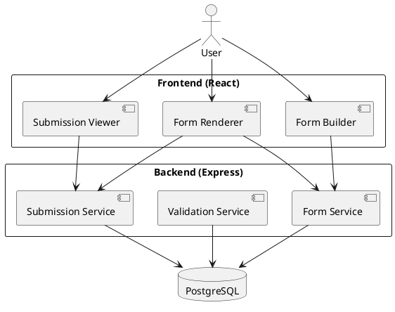
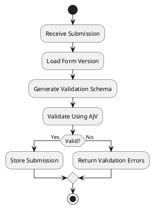
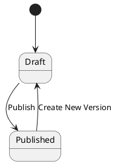
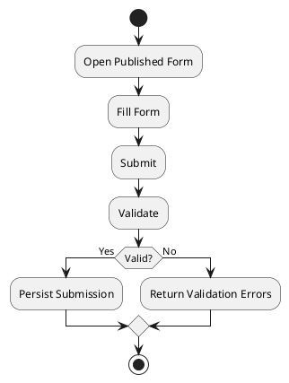

# Architecture Specification

## Overview

The Dynamic Form Builder Engine is a configuration-driven platform that allows users to create forms, define validation rules, publish forms, collect submissions, and manage form versions without requiring application code changes.

The architecture separates:

* Form Definition
* Form Rendering
* Form Validation
* Submission Storage

This ensures flexibility, scalability, and maintainability.

---

# Architectural Principles

## Configuration Driven

Form behavior must be controlled through stored configuration rather than hardcoded application logic.

---

## Separation of Concerns

The system separates:

* Form definition
* Validation logic
* Rendering logic
* Submission persistence

---

## Historical Integrity

Submissions must always remain linked to the exact form version that generated them.

---

## Immutable Published Versions

Published versions cannot be modified.

Changes create new versions.

---

# High-Level Architecture



---

# System Components

## Frontend

Responsibilities:

* Form management
* Form creation
* Dynamic rendering
* Submission entry
* Submission viewing

Technology:

* React
* TypeScript
* Vite
* Tailwind CSS
* React Hook Form
* TanStack Query

---

## Backend

Responsibilities:

* Form management
* Version management
* Dynamic validation
* Submission persistence
* API exposure

Technology:

* Node.js
* Express
* TypeScript
* AJV
* Prisma

---

## Database

Responsibilities:

* Form storage
* Version storage
* Submission storage

Technology:

* PostgreSQL
* JSONB

---

# Domain Model

## Form

Represents the logical form.

Example:

```text
Customer Registration
```

A form may have many versions.

---

## Form Version

Represents an immutable snapshot of a form.

Example:

```text
Customer Registration v1
Customer Registration v2
```

Each submission references exactly one version.

---

## Submission

Represents a completed form response.

Example:

```json
{
  "fullName": "John Doe",
  "email": "john@example.com"
}
```

---

# Form Configuration Model

Each form version stores configuration as JSONB.

Example:

```json
{
  "title": "Customer Registration",
  "fields": [
    {
      "id": "fullName",
      "label": "Full Name",
      "type": "text",
      "required": true,
      "minLength": 3,
      "order": 1
    },
    {
      "id": "email",
      "label": "Email",
      "type": "email",
      "required": true,
      "order": 2
    }
  ]
}
```

---

# Rendering Architecture

The frontend renderer consumes configuration and selects a rendering strategy.

```text
Form Schema
      ↓
Renderer Strategy
      ↓
UI
```

---

## Standard Renderer

Layout:

```text
Name

[____________]

Email

[____________]
```

---

## Compact Renderer

Layout:

```text
Name   [__________]
Email  [__________]
```

---

# Validation Architecture

Validation is generated dynamically from configuration.

No form-specific validation logic exists in code.

---

## Validation Flow



---

# Versioning Strategy

## Problem

Published forms may evolve over time.

Without versioning:

* Old submissions become invalid.
* Historical integrity is lost.

---

## Solution

Create immutable snapshots.

Example:

```text
Customer Registration v1
```

Receives:

```text
25 submissions
```

Later:

```text
Customer Registration v2
```

Receives:

```text
10 submissions
```

Submissions remain linked to the version that generated them.

---

# Form Lifecycle



---

# Submission Lifecycle



---

# Error Handling Strategy

## Validation Errors

Example:

```json
{
  "errors": [
    {
      "field": "email",
      "message": "Invalid email format"
    }
  ]
}
```

---

## Not Found Errors

Example:

```json
{
  "error": "Form not found"
}
```

---

## Internal Errors

Example:

```json
{
  "error": "Internal server error"
}
```

---

# Security Considerations

Although authentication is intentionally excluded from scope:

* Validate all request payloads.
* Sanitize user input.
* Use parameterized queries via Prisma.
* Restrict form submissions to published forms only.

---

# Scalability Considerations

Future improvements:

* Authentication
* Role management
* Form analytics
* Submission exports
* File uploads
* Search
* Multi-tenant support

Current architecture supports these extensions without requiring major redesign.
