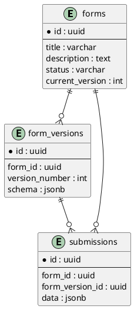

# Database Schema

## Overview

The Dynamic Form Builder Engine uses PostgreSQL as its primary datastore.

The database is designed around three core concepts:

* Forms
* Form Versions
* Submissions

This design supports:

* Dynamic form definitions
* Immutable versioning
* Historical integrity
* Efficient submission storage

---

# Database Technology

## PostgreSQL

Reasons:

* Strong relational capabilities
* Native JSONB support
* Excellent indexing options
* Reliable transactional guarantees

---

## Prisma ORM

Prisma is used to:

* Define models
* Generate migrations
* Provide type-safe database access
* Simplify relationships

---

# Entity Relationship Diagram



---

# Forms Table

Represents the logical form.

Example:

```text id="1wl7sl"
Customer Registration
```

A form may have multiple versions.

---

## SQL Schema

```sql id="xnq2lu"
CREATE TABLE forms (
  id UUID PRIMARY KEY,
  title VARCHAR(255) NOT NULL,
  description TEXT,
  status VARCHAR(20) NOT NULL,
  current_version INTEGER,
  created_at TIMESTAMP NOT NULL,
  updated_at TIMESTAMP NOT NULL
);
```

---

## Status Values

Supported values:

```text id="s1i8ws"
DRAFT
PUBLISHED
```

---

# Form Versions Table

Stores immutable snapshots of form configurations.

Each published form generates a version.

---

## SQL Schema

```sql id="qjlwm6"
CREATE TABLE form_versions (
  id UUID PRIMARY KEY,
  form_id UUID NOT NULL REFERENCES forms(id),
  version_number INTEGER NOT NULL,
  schema JSONB NOT NULL,
  created_at TIMESTAMP NOT NULL
);
```

---

## Why JSONB?

Form definitions are dynamic.

Example:

```json id="f1y0z9"
{
  "fields": [
    {
      "id": "fullName",
      "type": "text"
    }
  ]
}
```

Tomorrow:

```json id="u54vse"
{
  "fields": [
    {
      "id": "fullName",
      "type": "text"
    },
    {
      "id": "country",
      "type": "select"
    }
  ]
}
```

No database migrations required.

---

# Form Configuration Structure

The schema column stores:

```json id="q52pf7"
{
  "title": "Customer Registration",
  "fields": [
    {
      "id": "fullName",
      "label": "Full Name",
      "type": "text",
      "required": true,
      "minLength": 3,
      "maxLength": 50,
      "order": 1
    },
    {
      "id": "email",
      "label": "Email",
      "type": "email",
      "required": true,
      "order": 2
    }
  ]
}
```

---

# Submissions Table

Stores submitted form responses.

Each submission references:

* Form
* Form Version

This preserves historical integrity.

---

## SQL Schema

```sql id="m1cl08"
CREATE TABLE submissions (
  id UUID PRIMARY KEY,
  form_id UUID NOT NULL REFERENCES forms(id),
  form_version_id UUID NOT NULL REFERENCES form_versions(id),
  data JSONB NOT NULL,
  submitted_at TIMESTAMP NOT NULL
);
```

---

# Submission Structure

Example:

```json id="9gv3h9"
{
  "fullName": "John Doe",
  "email": "john@example.com"
}
```

The backend does not need to know field names in advance.

All submissions are validated against their associated form version.

---

# Versioning Strategy

## Problem

Forms change over time.

Example:

### Version 1

```text id="t20lmk"
Name
Email
```

Receives:

```text id="9d9ut6"
50 submissions
```

Later:

### Version 2

```text id="xrbh17"
Name
Email
Country
```

Receives:

```text id="j0pr9e"
25 submissions
```

Without versioning:

* Old submissions become incompatible
* Historical accuracy is lost

---

## Solution

Each publication creates a snapshot.

Example:

```text id="hzt0na"
Form
  ├── Version 1
  ├── Version 2
  └── Version 3
```

Submissions always reference the version that generated them.

---

# Prisma Models

## Form

```prisma id="0phv5j"
model Form {
  id             String        @id @default(uuid())
  title          String
  description    String?
  status         FormStatus
  currentVersion Int?
  createdAt      DateTime      @default(now())
  updatedAt      DateTime      @updatedAt

  versions       FormVersion[]
  submissions    Submission[]
}
```

---

## FormVersion

```prisma id="m2x2s3"
model FormVersion {
  id            String       @id @default(uuid())
  formId        String
  versionNumber Int
  schema        Json
  createdAt     DateTime     @default(now())

  form          Form         @relation(fields: [formId], references: [id])
  submissions   Submission[]
}
```

---

## Submission

```prisma id="wqjyhy"
model Submission {
  id             String       @id @default(uuid())
  formId         String
  formVersionId  String
  data           Json
  submittedAt    DateTime     @default(now())

  form           Form         @relation(fields: [formId], references: [id])
  formVersion    FormVersion  @relation(fields: [formVersionId], references: [id])
}
```

---

## Form Status Enum

```prisma id="1tzkm0"
enum FormStatus {
  DRAFT
  PUBLISHED
}
```

---

# Indexing Strategy

## Forms

```sql id="0q4e35"
CREATE INDEX idx_forms_status
ON forms(status);
```

---

## Form Versions

```sql id="m1lc4k"
CREATE INDEX idx_form_versions_form_id
ON form_versions(form_id);
```

---

## Submissions

```sql id="uyd7ww"
CREATE INDEX idx_submissions_form_id
ON submissions(form_id);

CREATE INDEX idx_submissions_version_id
ON submissions(form_version_id);
```

---

# Migration Strategy

Use Prisma Migrations.

Example:

```bash id="my9i6n"
npx prisma migrate dev
```

This ensures:

* Reproducible environments
* Version-controlled schema changes
* Consistent deployments

---

# Future Database Enhancements

Possible future additions:

* Users table
* Roles table
* Submission audit logs
* Form analytics
* File attachments
* Soft deletes
* Multi-tenancy

The current schema intentionally remains minimal to satisfy the assessment requirements while preserving extensibility.
